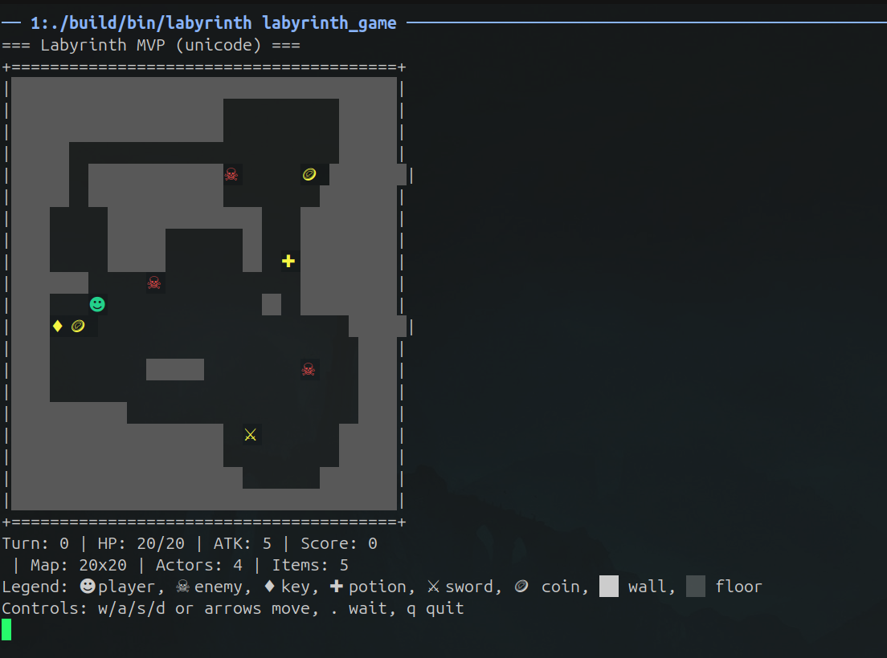
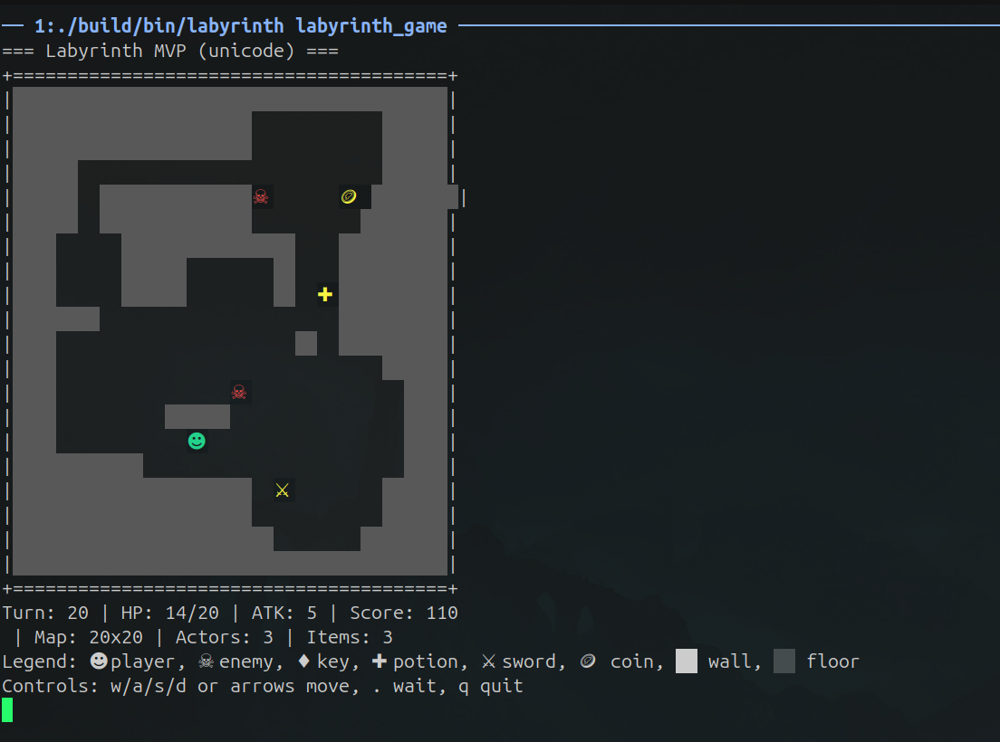
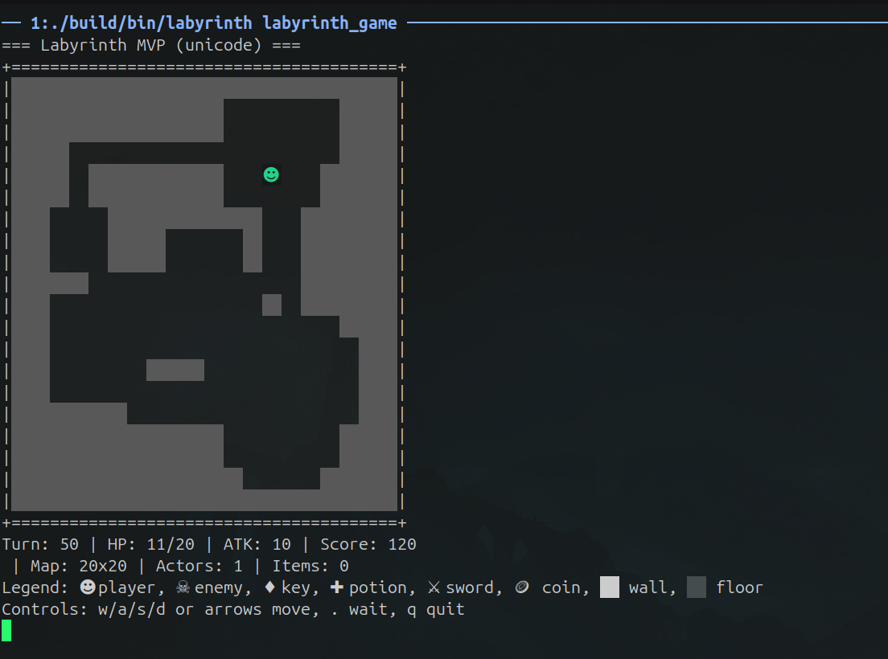

# labyrinth

Console rogue-like in modern C++20 with a generated labyrinth, turn-based movement, enemies, combat and collectible items.

## Build (out-of-source recommended)
```bash
cmake -S . -B build -DCMAKE_BUILD_TYPE=Release
cmake --build build --parallel
```

## Run
```bash
./build/bin/labyrinth
```

Default symbol set is ASCII. You can switch at runtime:
```bash
./build/bin/labyrinth --symbols=ascii
./build/bin/labyrinth --symbols=unicode
```
Or via env var:
```bash
LABYRINTH_SYMBOLS=ascii ./build/bin/labyrinth
```

### Controls (MVP)
- `w` `a` `s` `d`: move player (no Enter needed in terminal)
- Arrow keys: move player
- `.`: wait one turn
- `q`: quit

## Unicode gameplay

These screenshots show one gameplay session with Unicode symbols. The map and
route can vary between runs; the screenshots do not specify a reproducible seed
or command sequence.

### Starting the game

Turn 0: HP 20/20, attack 5, score 0, four actors and five items.



### Exploring and collecting items

Turn 20: HP 14/20, attack 5, score 110, three actors and three items remaining.



### Clearing enemies and collecting all items

Turn 50: HP 11/20, attack 10, score 120, only the player remains and no items
remain. This state does not imply that a victory condition has been implemented.



## Tests
```bash
ctest --test-dir build --output-on-failure
```

## Options
- `LABYRINTH_WARNINGS_AS_ERRORS=ON` — treat warnings as errors.
- `LABYRINTH_ENABLE_SANITIZERS=ON` — enable ASan/UBSan on non-MSVC.
- `LABYRINTH_BUILD_TESTS=OFF` — skip tests.

## Layout
See `src/` and `tests/` skeleton matching the implementation plan.
